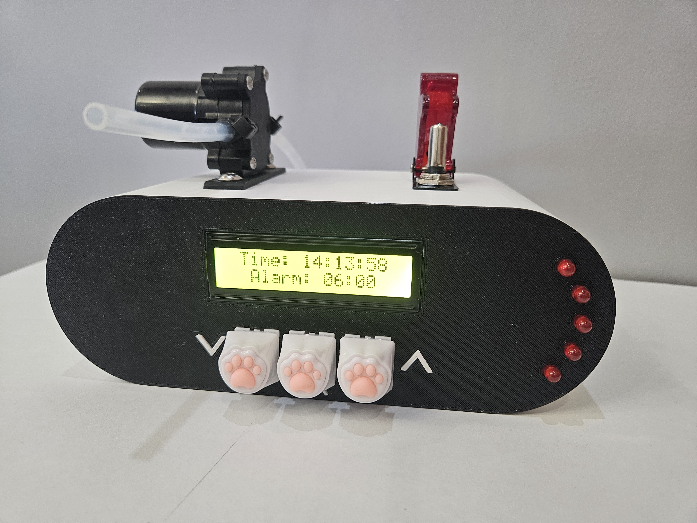
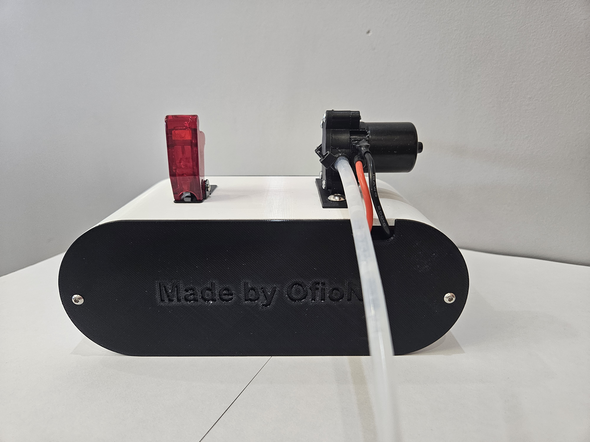
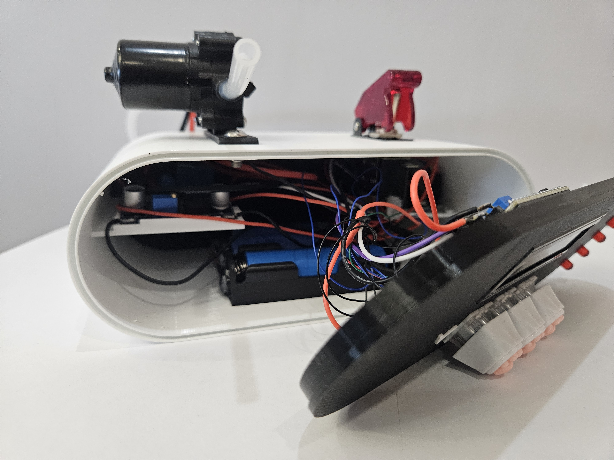

<h1 align="center">WaterAlarmClock 🚿⏰</h1>


A fully custom-built ESP32-C3 **water-based alarm clock**, featuring a real-time clock module, LCD display, configurable alarm, LED pre-alarm effects, a relay-controlled washer pump, and a fully 3D-printed enclosure designed in Autodesk Fusion — creating a unique and practical wake-up mechanism.

---

## 📸 Project Preview

📐 Enclosure Model
<p align="center">  </p>
🛠️ Final Product
<p align="center"><table> <tr> <td></td> <td></td> <td></td> </tr> </table></p>

## ⭐ Features

- LCD 1602 I2C displaying current date & time
- Configurable alarm using three hardware buttons (+ / – / OK)
- Non-volatile storage (Preferences) for alarm settings
- Energy-saving mode: long press +/– toggles LCD on/off
- Pre-alarm LED sequence 30 seconds before the actual alarm
- Water alarm using a 12V washer pump controlled via relay
- RTC DS1302 for accurate timekeeping with CR2032 backup
- Custom-designed enclosure (Fusion 360) with 3D-printed parts

---

## 🛠️ Components Used

| Component                            | Description                         |
| ------------------------------------ | ----------------------------------- |
| **ESP32-C3**                         | Main microcontroller                |
| **LCD 1602 I2C**                     | User interface (time display)       |
| **RTC DS1302 + CR2032**              | Real-time clock with backup battery |
| **3 mechanical buttons**             | Navigation: + / – / OK              |
| **5 red LEDs**                       | Pre-alarm notification              |
| **BC337 transistor**                 | LED driving                         |
| **Relay module (5V, 10A)**           | Controls 12V washer pump            |
| **Windshield washer pump 12V**       | Physical "water alarm"              |
| **LM2596 step-down regulator**       | Power supply                        |
| **3× 18650 Li-Ion cells (2200 mAh)** | Main battery                        |
| **Battery holder**                   | 3-cell configuration                |
| **Silicone tube (4×6 mm)**           | Water transport                     |
| **3D-printed enclosure**             | Designed in Autodesk Fusion         |


---
## 🧠 Alarm Logic
**Button Functions**
- Short press + → +15 minutes
- Short press – → –15 minutes
- Long press + (5s) → enable LCD
- Long press – (5s) → disable LCD
- OK → enter/exit alarm setting mode & save to NVS

**LED Pre-alarm Sequence (starts 30s before alarm)**
- 20 seconds – blinking every 1s
- 10 seconds – blinking every 0.25s
- LEDs turn off until alarm triggers

**Alarm (Relay Sequence)**
- 2s ON → 5s OFF → 2s ON → 2.5s OFF → final 2s ON
- Pump stops, LEDs turn off
- LCD resets to normal view

---

## 📂 Repository Structure

```
WaterAlarmClock/
│
├── src/
│   └── WaterAlarm.ino
│
├── stl/
│   ├── front.stl
│   ├── back.stl
│   ├── main.stl
│   └── stamps.stl
│
└── images/
    ├── frontModel.png
    ├── frontFinal.png
    ├── backFinal.png
    └── insideFinal.png

```


---

## ▶️ How to Run

1. Install required Arduino libraries:
- LiquidCrystal_I2C
- RtcDS1302
- ThreeWire
- Preferences (built-in for ESP32)

2. Upload the code to your board:
```
src/WaterAlarm.ino
```

3. Assemble hardware using pin mapping inside code:

| Component | GPIO |
|----------|------|
| LCD SDA/SCL | 8 / 9 |
| DS1302 DAT/CLK/RST | 5 / 6 / 7 |
| Relay | 4 |
| Buttons + / – / OK | 3 / 2 / 1 |
| LED control | 0 |

4. Print the enclosure using the STLs inside `/stl/`.

5. Power the ESP32-C3 + pump system and enjoy your water alarm 😄

---

## 💡 What I Learned

This project taught me:

- How to design a complete embedded system from code + electronics + 3D enclosure  
- How to use non-volatile memory (`Preferences`) to store settings  
- How to build multi-stage event logic without blocking `loop()`  
- How to design enclosures in Fusion 360 and export printable STL  
- How to structure projects for GitHub and documentation  

---
## 🚀 Future Ideas
- **Mobile app integration**
    - Connect via BLE or Wi-Fi and manage the device from a companion app.

- **Water level sensor**
    - Detect empty tank and notify the user via buzzer, LED, or phone app.

- **Multiple alarms support**
    - Allow adding several alarms with custom repetition (daily, weekdays, intervals).
---

## 📜 License

This project is licensed under the **MIT License** – feel free to use or modify it.
