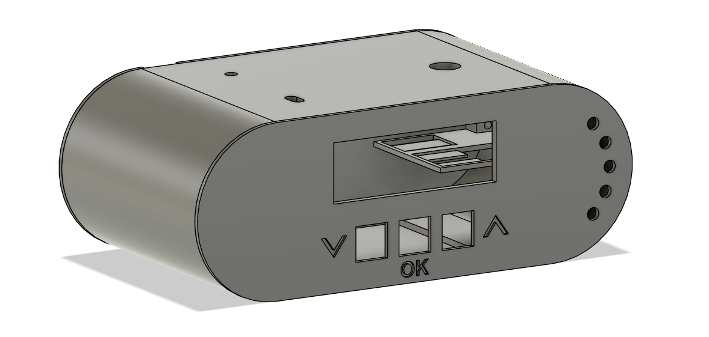

# ⏰ Water Alarm Clock (Arduino Project)

A fully functional **water-based alarm clock** built using Arduino, RTC DS1302, I2C LCD, relay control, LED indicators and a custom 3D-printed enclosure.

The alarm is designed to activate a water pump using a relay, creating a unique and practical wake-up mechanism.  
The project includes complete source code and a printable STL housing.

---

## 📸 Project Preview



---

## ⭐ Features

- ✔️ Real-time clock using **DS1302**
- ✔️ LCD display with automatic on/off
- ✔️ Alarm time saved in non-volatile memory (**Preferences**)
- ✔️ Adjustable alarm using three physical buttons (+ / – / OK)
- ✔️ Early warning LED sequence (30 seconds before alarm)
- ✔️ Multi-stage alarm relay activation (water pump)
- ✔️ Custom 3D-printed enclosure included (STL)
- ✔️ Modular, extendable code (servo motor planned)

---

## 🛠️ Hardware Used

- ESP32
- RTC **DS1302** + battery backup
- I2C LCD 16×2
- Relay module (5V)
- LEDs x5
- 3x buttons (UP, DOWN, OK)
- 3D-printed housing (included in `/stl`)

---

## 📂 Repository Structure

```
WaterAlarmClock/
│
├── src/
│ └── WaterAlarm.ino
│
├── stl/
│ └── enclosure.stl # 3D printed housing (Fusion 360 exported)
│
└── images/
└── device_render.png # Preview render
```


---

## ▶️ How to Run

1. Install dependencies:
   - `LiquidCrystal_I2C`
   - `RtcDS1302`
   - `ThreeWire`
   - `Preferences` (ESP32)

2. Upload the code to your board:
```
src/WaterAlarm.ino
```

3. Assemble hardware using pin mapping inside code:

| Component | GPIO |
|----------|------|
| LCD SDA/SCL | 8 / 9 |
| DS1302 DAT/CLK/RST | 5 / 6 / 7 |
| Relay | 4 |
| Buttons + / – / OK | 3 / 2 / 1 |
| LED control | 0 |

4. Print enclosure from `/stl/enclosure.stl`

5. Enjoy your water alarm 😄

---

## 💡 What I Learned

This project taught me:

- How to design a complete embedded system from code + electronics + 3D enclosure  
- How to use non-volatile memory (`Preferences`) to store settings  
- How to build multi-stage event logic without blocking `loop()`  
- How to design enclosures in Fusion 360 and export printable STL  
- How to structure Arduino projects for GitHub and documentation  

---

## 📜 License

This project is licensed under the **MIT License** – feel free to use or modify it.
